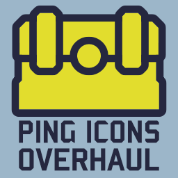
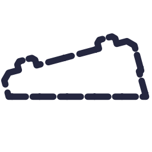
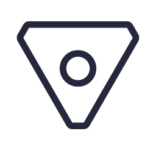
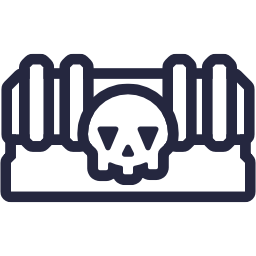
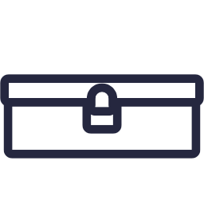
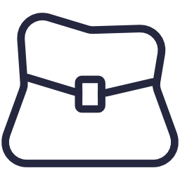
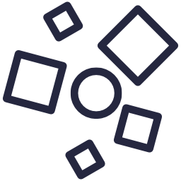
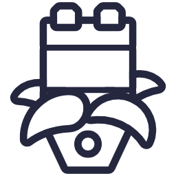
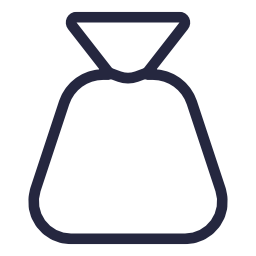
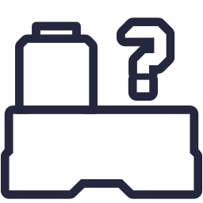

# Overview

**Ping Icons Overhaul** is a **Risk of Rain 2** mod that replaces the default ping icons with custom ones for almost, making them more visually appealing and easier to understand.

# Featured icons

Categories are taken from the fandom wiki - [Interactables - Risk of Rain 2 Wiki](https://riskofrain2.fandom.com/wiki/Interactables)

## Barrels

| Interactable | Icon                                                                   |
| ------------ | ---------------------------------------------------------------------- |
| Barrel       |            |
| Void Stalk   |  |

## Charging zones

| Interactable          | Icon |
| --------------------- | ---- |
| Assessment Focus      |      |
| Cell Vent             |      |
| Deep Void Signal      |      |
| Pillar of Blood       |      |
| Pillar of Design      |      |
| Pillar of Mass        |      |
| Pillar of Soul        |      |
| Primordial Teleporter |      |
| Teleporter            |      |

## Chests

| Interactable                   | Icon                                                                                                |
| ------------------------------ | --------------------------------------------------------------------------------------------------- |
| Adaptive Chest                 |                    |
| Aurelionite Fragment           |  |
| Cloacked Chest                 |                                  |
| Crashed Multishop "Delivery"   |                                                       |
| Encrusted Cache                |                                                       |
| Equipment Barrel               |                                                       |
| Equipment Triple Shop          |                                                       |
| Large Category Chest - Damage  |                                                       |
| Large Category Chest - Healing |                                                       |
| Large Category Chest - Utility |                                                       |
| Large Chest                    |                                                       |
| Legendary Chest                |                                                       |
| Lunar Pod                      |                                                       |
| Multishop Terminal             |                                                       |
| Rusty Lockbox                  |                                                       |
| Scavenger's Sack               |                                                       |
| Small Category Chest - Damage  |                                                       |
| Small Category Chest - Healing |                                                       |
| Small Category Chest - Utility |                                                       |
| Small Chest                    |                                                       |
| Void Cradle                    |                                                       |
| Void Potential                 |                                                       |

## Drones

| Interactable             | Icon |
| ------------------------ | ---- |
| Broken Combat Drone      |      |
| Broken Emergency Drone   |      |
| Broken Equipment Drone   |      |
| Broken Healing Drone     |      |
| Broken Incinerator Drone |      |
| Broken Missile Drone     |      |
| Broken Turret            |      |
| Lemurian Egg             |      |
| TC-280                   |      |

## Environment Specific

| Interactable               | Icon |
| -------------------------- | ---- |
| Artifact Pickup |  |
| Alloy Vulture Nest         |      |
| Aurelionite Geode          |      |
| Broken REX                 |      |
| Cauldron                   |      |
| Chef's Wok                 |      |
| Compound Generator         |      |
| Fan                        |      |
| Glass Frog                 |      |
| Halcyon Beacon             |      |
| Laptop                     |      |
| Lunar Bud                  |      |
| Lunar Seer                 |      |
| Newt Altar                 |      |
| Obelisk                    |      |
| Pressure Plate             |      |
| Radio Scanner              |      |
| Slab                       |      |
| Survivor Pod               |      |
| Survivor Suspended In Time |      |
| Timed Chest                |      |

## Pickups

| Interactable    | Icon                                           |
| --------------- | ---------------------------------------------- |
| Command Essence |  |
| Fuel Array      |  |
| Generic Pickup  |  |
| Log Pickup      |  |

## Portals

| Interactable       | Icon |
| ------------------ | ---- |
| Artifact Portal    |      |
| Blue Portal        |      |
| Celestial Portal   |      |
| Deep Void Portal   |      |
| Destination Portal |      |
| Gold Portal        |      |
| Green Portal       |      |
| Infinite Portal    |      |
| Null Portal        |      |
| Void Portal        |      |

## Printers

| Interactable   | Icon                                           |
| -------------- | ---------------------------------------------- |
| 3D Printer     |  |
| Cleansing Pool |  |

## Scrapper

| Interactable | Icon                                           |
| ------------ | ---------------------------------------------- |
| Scrapper     |  |

## Shrines

| Interactable           | Icon |
| ---------------------- | ---- |
| Altar of Gold          |      |
| Halcyon Shrine         |      |
| Shrine of Blood        |      |
| Shrine of Chance       |      |
| Shrine of Combat       |      |
| Shrine of Order        |      |
| Shrine of Rebirth      |      |
| Shrine of Shaping      |      |
| Shrine of the Mountain |      |
| Shrine of the Woods    |      |

## Skill related

| Interactables                | Icon |
| ---------------------------- | ---- |
| Beacon: Resupply             |      |
| Eclipse Zero Vending Machine |      |
| Quantum Tunnel               |      |
